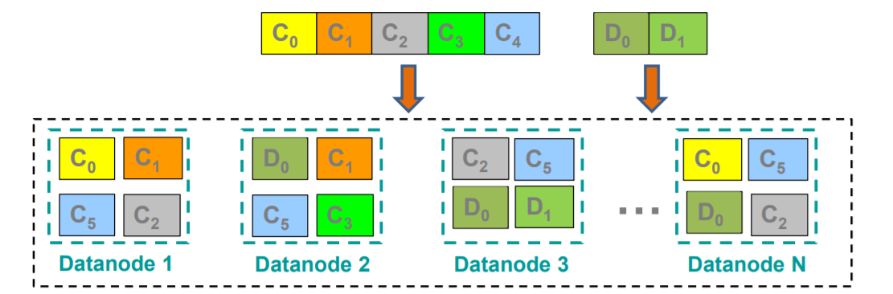

## Описание распределенной файловой системы HDFS, отказоустойчивость и масштабируемость.

HDFS (Hadoop Distributed File System) — файловая система, предназначенная для хранения файлов больших размеров, поблочно распределенных между узлами вычислительного кластера. Все блоки в HDFS имеют одинаковый размер, и каждый блок может быть размещен на нескольких узлах, размер блока и коэффициент репликации (количество узлов, на которых должен быть размещен каждый блок) определяются в настройках на уровне файла. Благодаря репликации обеспечивается устойчивость распределенной системы к отказам отдельных узлов. Файлы в HDFS могут быть записаны лишь однажды (модификация не поддерживается), а запись в файл в одно время может вести только один процесс.
Организация файлов в пространстве имен — традиционная иерархическая: есть корневой каталог, поддерживается вложение каталогов, в одном каталоге могут располагаться и файлы, и другие каталоги.

Размер блока достаточно большой, чтобы время _seek << время чтения блока_. Вся метаинформация была помещена на _namenode_’е. Слишком большие блоки — плохо, так как хуже параллелизм и операции над ними долгие. Обычно берут размер 64 MB или 128 MB.

_Составляющие_.
* _Datanode_ — их много, и они хранят непосредственно блоки файлов. Нода регулярно отправляет _NameNod_'e свой статус (показывает, что еще жива) и реже — репорт: информацию обо всех хранимых на этой ноде блоках. Это необходимо для поддержания нужного уровня репликации.
* _Namenode_ — хранит (в оперативной памяти) список всех _datanode_, а также всю метаинформацию о данных, хранящихся на _datanod_'ах.
* _Secondary Namenode_ — периодические подгружает батчами изменения с _namenod_'ы, при это сохраняя некий снепшот ее состояния, чтобы в случае чего можно было отослать его _namenod_'е, чтобы она все подгрузила. Иногда часть диска _secondary namenode_ монтируют к _namenod_'е, и тогда _namenode_ пишет уже через RDMA. _Secondary namenode_ — это скорее checkpoint namenode, чем backup namenode, но она может стать основной, если _Namenode_ надолго вышла из строя — но для этого нужно ручное переключение админа.

Масштабируемость и отказоустойчивость:
* Отказоустойчивость достигается за счет репликации.
* Масштабируемость простая — достаточно добавить _datanode_.

