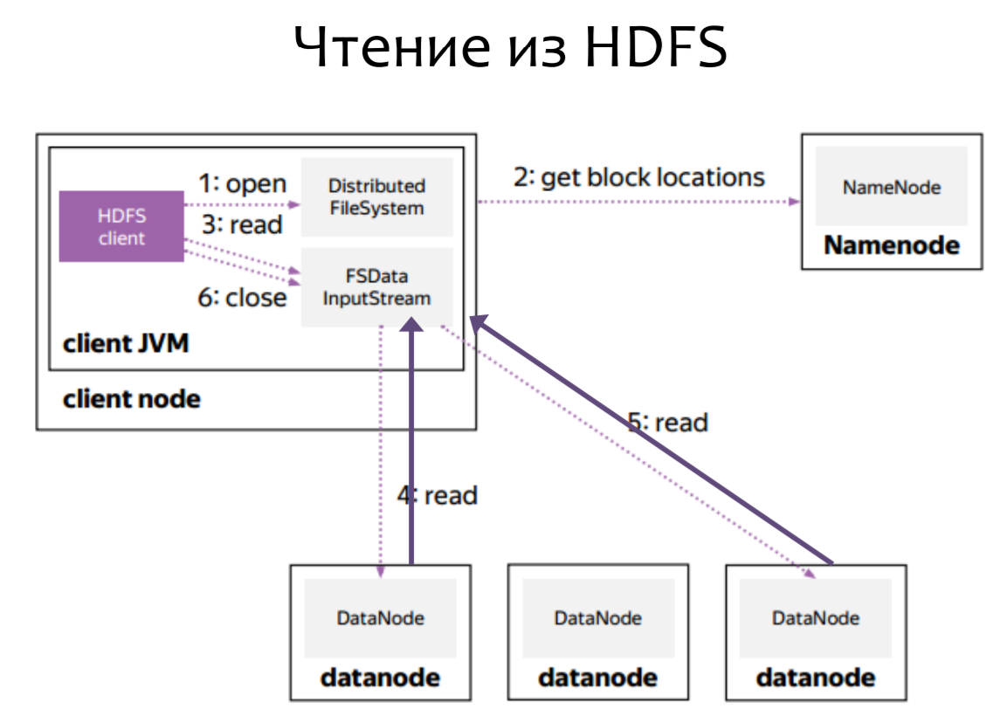
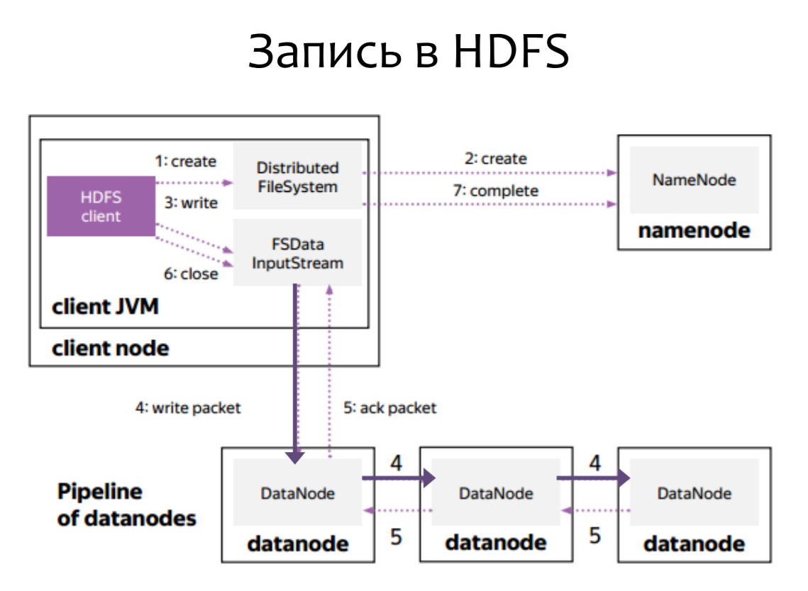

## Процесс чтения и запись данных в HDFS

### Чтение

Клиент создает некий объект _DistributedFileSystem_ (см. картинку), который знает о том, где находится _Namenode_. Этот объект идет на _Namenode_ и получает от нее по своему протоколу (к которому у нас доступа, в общем-то, нет) расположение нужных блоков. При этом _Namenode_ может проверить, имеем ли мы право вообще читать.
Дальше создается объект _FSDataInputStream_ (см.картинку), который получает расположение блока, идет за ним и получает данные. Прим. стрелки «пожирнее» на рисунке обозначают передаваемые данные), то есть данные клиенту поставляются напрямую с датанод.

### Запись

Запись немного посложнее, потому что нужно не только записать, но и обеспечить отказоустойчивость при записи. Так же создается некий объект _DistributedFileSystem_. Говорим _Namenode_, что хотим создать файл; при этом _Namenode_ может проверить, имеем ли мы право писать. Если все хорошо и права есть, то _Namenode_ инициализирует создание файла и выдает адреса датанод, на которых будут располагаться блоки, принадлежащие файлу.

После этого клиент пишет на первую датаноду, которой передает помимо самих данных еще и адреса, куда нужно записать реплики. И первая датанода, которой данные передал клиент, передает по цепочке данные другим датанодам (см. картинку). То есть клиент передал данные только на одну датаноду, дальше датаноды сами между собой разбираются, как и куда записывать реплики. Важно, что между клиентом и датанодой соединение считается относительно медленным, а соединения между датанодами (внутри кластера) считаются относительно быстрыми, поэтому передача данных устроена именно таким образом.

Когда последняя датанода записала данные, то сигнал об этом по цепочке передается обратно и доходит до клиента. Пока этот сигнал до него не дойдет, клиент не сбрасывает со своих локальных кэшей / буферов данные, которые он отправил на запись. Как такой сигнал клиентом получен, то данные можно сбросить.
При этом всем предусмотрено, что во время записи одна из датанод можете умереть, и в HDFS реализована система восстановления. Можно сказать, что выдаются новые ноды для записи или дописывается недостающее количество реплик.
