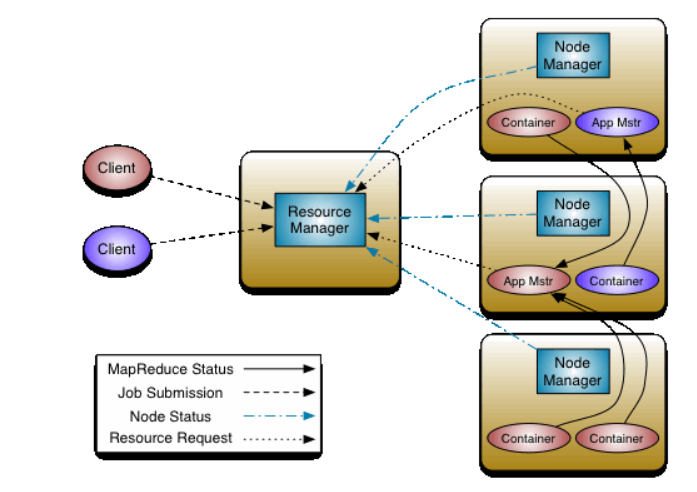

## Структура кластера Hadoop. Роли серверов. Как обеспечивается отказоустойчивость.

Основная идея Apache Hadoop YARN (Yet Another Resource Negotiator) состоит в том, чтобы разделить функциональные возможности управления ресурсами и планирования работы / мониторинга на отдельные демоны. Идея состоит в том, чтобы иметь глобальный ResourceManager (RM) и приложение Application Application (AM) для каждого приложения. Приложение представляет собой либо одну джобу, либо несколько.

* ResourceManager и NodeManager образуют структуру вычислений данных.
* ResourceManager — самая главная часть, он единолично распределяет ресурсы среди всех приложений в системе.
* NodeManager отвечает за контейнеры, контролирует использование ресурсов (процессор, память, диск, сеть) и сообщает об этом самому ResourceManager / Scheduler.
* ApplicationMaster отвечает за согласовывать ресурсов с ResourceManager и работау с NodeManager (-ами) для выполнения и мониторинга задач.

ResourceManager имеет два основных компонента: Scheduler и ApplicationManager.

* Планировщик отвечает за выделение ресурсов для различных запущенных приложений (распределяет в очереди). Он не выполняет мониторинг или отслеживание статуса для приложения и даже не дает никаких гарантий относительно перезапуска неудачных задач.

* ApplicationManager принимает джобы, все согласовывает для выполнения приложения и перезапускает его при сбое. Приложение ApplicationMaster для каждого приложения несет ответственность за согласование Планировщиком, отслеживает статус и мониторит прогресс.
