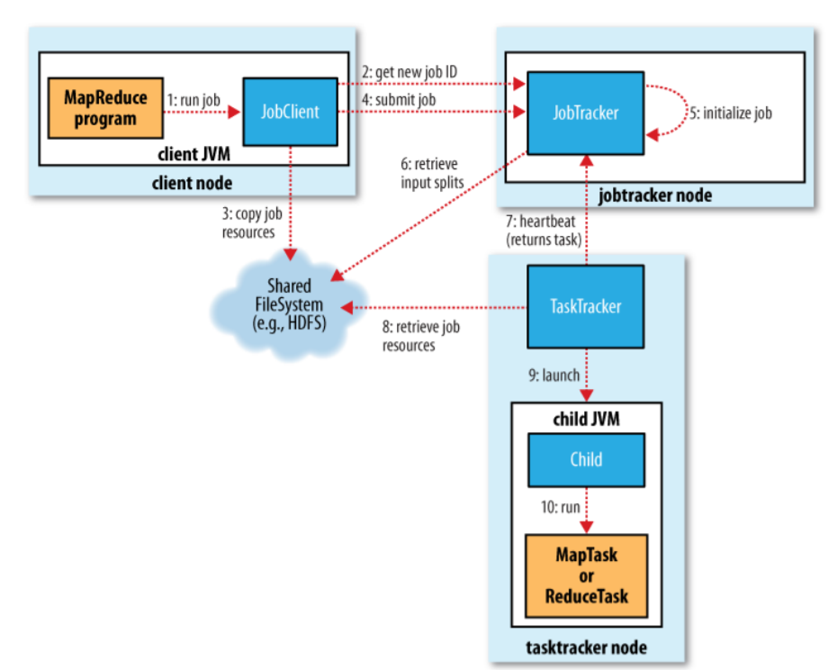

## Процесс выполнения задачи на кластере. Distributed cache.

1. Пользователь запускает программу _MapReduce_ на клиентской ноде.
1. _JobClient_ (на клиентской ноде) запрашивает у _JobTracker_'а (расположен на своей отдельной ноде) _id_ для своего джоба.
1. _JobClient_ отправляет файлы, используемые в джобе, в файловую систему (в YARN-e всем этим занимается _ResourceManager_).
1. _JobClient_ отправляет джобу _JobTracker_'у.
1. _JobTracker_ инициализирует полученную джобу: создает _map_- и _reduce_-таски, делает сплиты (разделения) ресурсов для джобы из файловой системы (полученные во время 3 пункта), отправляет таски и инфу по сплитам _TaskTracker_'ам (тоже расположены на своих нодах).
1. _TaskTracker_'ы вытаскивают из файловой системы кусочек изначального ресурса, выделенного ему сплитом (обычно одна _map_-таска - один сплит) и запускают у себя на нодах процессы, которые будут выполнять _map_- или _reduce_-таску на полученных файлах.
1. Таски постоянно отправляют _TaskTracker_'ам информацию по выполнению: статус задачи, счетчики... _TaskTracker_'ы же, в свою очередь, пересылают эту информацию _JobTracker_'у вместе с _heartbeat_'ом — сигналом, оповещающим о том, что таска еще выполняется и жива. Если _JobTracker_ перестает получать _heartbeat_'ы от какого-то _TaskTracker_'а, он помечает его «мертвым» и переотправляет задачу на все еще «живой» _TaskTracker_. На _TaskTracker_'ы, помеченные, как «мертвые», задачи посылаться больше не будут.

### Distributed cache

В распределенный кэш входят файлы, необходимые для работы конкретной таски. Файлы указываются в параметрах:
  * `-files`;
  * `-archive` (тогда будет разархивирован);
  * `-libjars` (будут добавлены в `CLASSPATH`) —
и тогда они будут сохранены на каждой рабочей ноде. Менять их таска не может.

Пример: `$ yarn jar <jar_file> <class> -files …`
