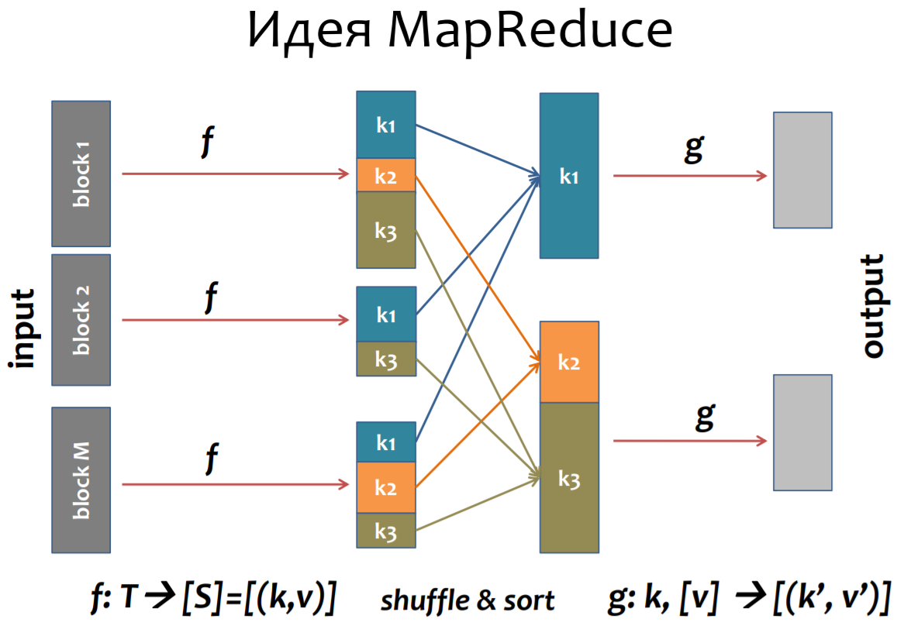

## Формальная модель MapReduce вычислений.

В модели _MapReduce_ примитивы обработки данных называются распределителями (_mapper_) и редукторами (_reducer_).

На фазе распределения MapReduce принимает входные данные и передает каждый элемент данных распределителю. На фазе редукции reducer обрабатывает промежуточные результаты, полученные mappers, и вычисляет окончательный результат.

В качестве основной единицы данных используется пара ключ / значение.

_MapReduce_ проектировался с учетом обширного опыта написания масштабируемых программ. Двухфазная структура наблюдалась при масштабировании многих систем и была поэтому положена в основу каркаса.

Чтобы распределение, редукция, разбиение и тасование могли органично работать совместно, необходимо принять некое соглашение о единой структуре обрабатываемых данных. Она должна быть достаточно гибкой и общей, отвечающей потребностям большинства приложений обработки данных, которые мы хотели бы поддержать.

Еще раз: в _MapReduce_ в качестве основных примитивов используются списки и пары ключ/значение.

Между фазами _map_ и _reduce_ происходит группировка и сортировка по ключу типа _k2_.

Task   | Input        | Output
------ | ------------ | ------------
Map    | _<k1, v1>_   | _[<k2, v2>]_
Reduce | _<k2, [v2]>_ | _[<k3, v3>]_

На практике распределитель (_mapper_) часто игнорирует ключ _k1_. Например, в программе подсчета слов распределитель (_mapper_) принимает пару _<String filename, String file_content>_ и попросту игнорирует ключи _filename_.

Также в программе подсчета слов типы данных _k2_ и _k3_ совпадают, как и типы _v2_ и _v3_. Но в других задачах может быть иначе.
