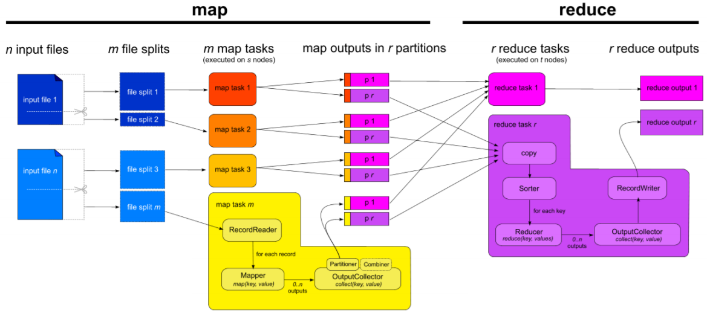
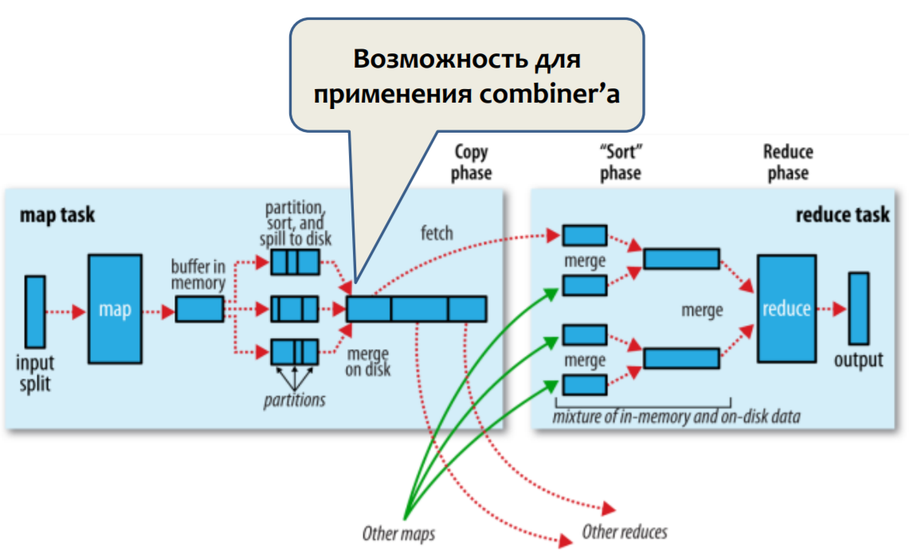

## MapReduce: Combiner, Comparator, Partitioner.

Схема MapReduce.

### Combiner

Hadoop сортирует результат работы Map — объем относительно невелик. А Combiner агрегирует сортированный фрагмент, получая плюшки: меньше данных пересылать на Reduce и меньше там обрабатывать;

Важно: Combiner не меняет типы _<k2, v2>_ (так как применяется 0 или более раз).

_Примеры_.
* _reduce = sum_ ⇒ _combine = sum_;
* _reduce = avg_ ⇒ _combine = (sum, count)_.

### Comparator

Hadoop дает возможность задавать функцию сравнения ключей. Сравнение зависит от:
* типа данных, метод `compareTo`;
* класса-компаратора, наследует _WritableComparator_:
    * `job.setSortComparatorClass()` (для Java API);
    * `-D mapreduce.job.output.key.comparator.class=<class>` (для streaming).

Пример задачи — сортировка по количеству.

### Partitioner

Контролирует вычисления номера редьюсера по ключу _k2_.
По умолчанию — `HashPartitioner`:
* тип ключа k2 должен определять `hashCode()`
* `hashCode() % R`;
Либо `abstract class Partitioner<K, V>`:
* oпределить метод: `int getPartition(k, v, R)`;
* 1job.setPartitionerClass()1 (для Java API);
* 1-partitioner <class>1 (для streaming).

Пример задачи — обратный индекс (по файлам со словами получить список слов, где для каждого слова написаны файлы, где оно встречается).
