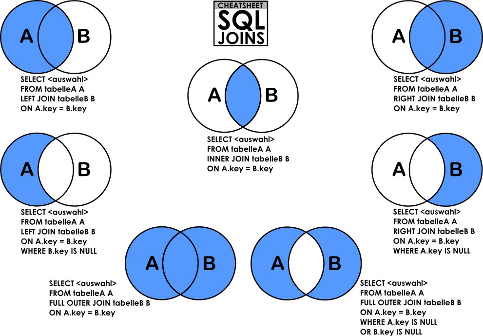
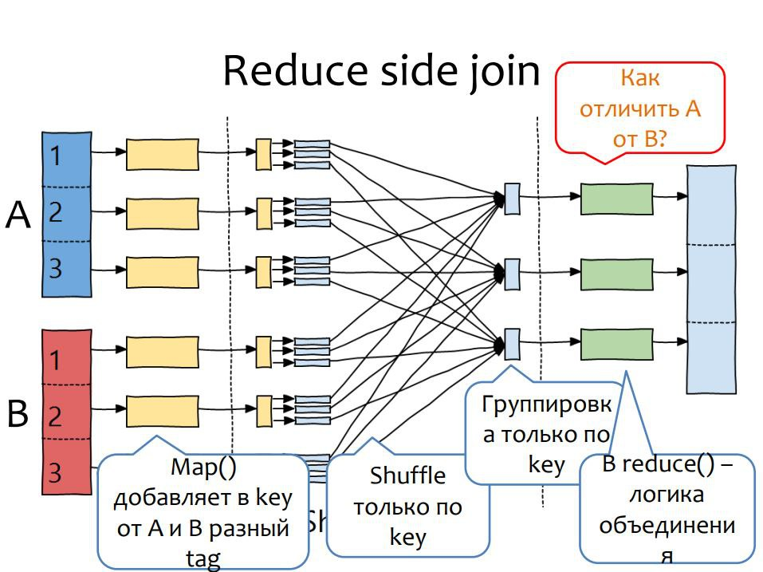
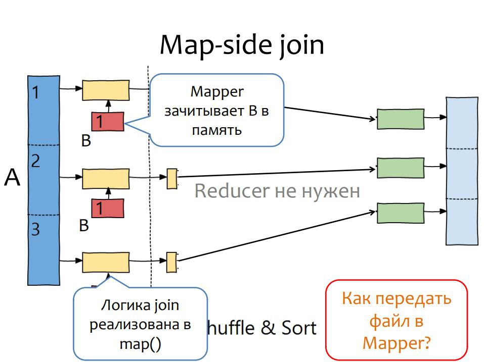
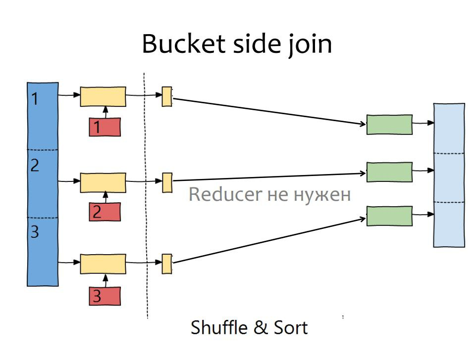

## Типы Join в MapReduce.

_Join_ — операция соединения; предназначена для обеспечения выборки данных из двух таблиц и включения этих данных в один результирующий набор.

В случае _MapReduce_ он нужен, когда мы берем, например, файлы из двух директорий или файлов.

Определение того, какие именно исходные строки войдут в результат и в каких сочетаниях, зависит от типа операции соединения и от явно заданного условия соединения.

В MapReduce существует 3 типа _Join_:
* Reduce-Side Join;
* Map-Side Join;
* Bucket-Side Join.

### Reduce-Side Join

Идея заключается в том, чтобы как-то отметить, из какого датасета пришли данные, и реализовать логику объединения на _reduce_ стадии.

Этапы работы:

* На стадии _map_ необходимо добавить _tag_ к ключу: `[key, value] -> [(key, tag), value]`. Это нужно, чтобы мы смогли отличить, из какой директории к нам пришел файл (отличаем их по `tag`).
* Редьюсер выбирается только по _key_ — для этого необходимо модифицировать _partitioner_.
* Группировка происходит только по _key_ — для этого необходимо модифицировать _comparator_.
* Сортировка производится по обоим полям.
* _Reduce_-стадия:
  * если в _reduce_ нужен _tag_, то необходимо добавить его в _value_;
  * далее в _reduce_ производится операция соединения.

Reduce-Side Join хорош тем, что он всегда работает, но затратный.

Желая ускорить _Join_, были придуманы следующие два подхода.

### Map-Side Join

Идея заключается в том, что если второй датасет не очень большой (помещается в память), то _mapper_ сможет прочитать его и реализовать логику _Join_.

### Bucket-Side Join

Учитывая, что _MapReduce_ часто занимает не одну стадию, то в процессе выполнения получаются какие-то партицированные данные, а также, учитывая, что память ограничена, хотелось бы, чтобы _mapper_ читал не весь второй датасет, а только какую-то конкретную его часть (если второй датасет большой и не помещается в память).

Идея в том, что мы можем перед _map_ знать, какие ключи могут всретиться. И именно эти ключи мы берем из второго датасета.

Формально:
* меньший датасет _B_ не помещается в память;
* большой датасет _A_ разбит на диапазоны ключей;
* _mapper_ читает в память только те ключи _B_, которые он будет обрабатывать из _A_, а _B_ заранее разбит на такие же диапазоны, или мы читаем все, но запоминаем только нужное.

