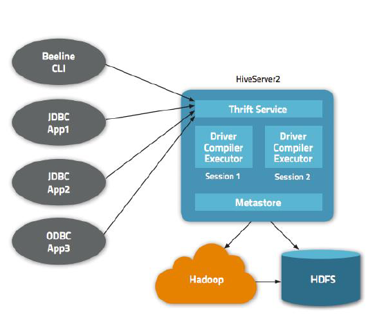

## Описание системы Hive для работы с большими данным (где хранится метаинформация, где хранятся реальные данные, возможности системы).

Когда данных мало, можно пользоваться классическими СУБД типа Oracle, SQL. Но в связи с увеличением количества данных они перестали справляться с нагрузкой.

Нужно перемещать данные в облака или пользовать Hadoop... Как обрабатывать? Есть специалисты, знающие SQL, значит, надо обеспечить возможность работать с данными в HDFS посредством запросов SQL.

Hive — распределенное хранилище данных; оно управляет данными, хранимыми в HDFS, и предоставляет язык запросов на базе SQL для работы с этими данными. Или, по-другому, Hive трансформирует SQL синтаксис в MapReduce задачу.

### Использование Hive

_Возможности_.
* Создать таблицу, создать представление (то есть создать описание над файлами, находящимися в HDFS).
* Использовать команды `select`, `where`, `group`, `join`, `order by` и другие.
* Использовать User Defined Functions (UDF).
* Использовать Streaming (custom map and reduce) – позволяет интегрировать в ваш SQL-запрос MapReduce Streaming.

Вопрос использования Hive – это вопрос использования SQL-запросов. В Hive существует два вида таблиц:
* managed – будет создана в вашей локальной директории Hive, где вы работаете;
* external – таблица поверх данных, которые не лежат в вашей директории HDFS.

_Классический сценарий_:
* создаем external-таблицу на какие-то данные, которые лежат в HDFS. Можно делать несколько таблиц на основе разного рода данных;
* поверх созданной таблицы или таблиц делаем наши запросы;
* наблюдаем результат на экране монитора.

_Как именно это выглядит_:
* запросы пишутся в файле;
* первым действием создаем metastore (или, по-другому, database — создание места, где будет храниться таблица) посредством запуска файла init.sql;
* файл запускается на выполнение командой;
* cоздаем файл типа name_of_file.sql, в котором надо сделать три вещи:
  * создать таблицу;
  * заполнить ее данными;
  * выполнить запросы поверх созданной таблицы;
* выполнить файл.

### Архитектура

* Metastore – база в обыкновенной СУБД, в которой хранятся все описатели для созданных логических единиц Hive.
* Драйвер исполнения, компилятор и исполнитель.
* Трифт-сервис – как с помощью удаленного доступа использовать инструментарий Hive (типа функций Hive в вашей программе, рассматривать не будем).
