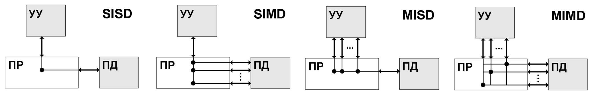

##  Основные методы организации параллельной обработки данных в архитектуре современных вычислительных систем. Классификация по Флинну. Классы систем: SMP, NUMA, ссNUMA, MPP.

Классификация методов организации параллельной обработки данных по Флинну. Это самая ранняя классификация, и она базируется на понятии потока (последовательность команд или данных, выполняемых процессом).

* SISD (Single Instruction Stream, Single Data Stream). Одиночный поток команд и одиночный поток данных. К классу SISD, прежде всего, относятся классические последовательные машины, или, иначе, машины фон-неймановского типа. В таких машинах есть только один поток команд, все команды обрабатываеются последовательно друг за другом, и каждая команда инициирует одну скалярную операцию. Не имеет значения, используется ли конвейерная обработка данных для увеличения скорости выполнения арифметических операций.

* SIMD (Single Instruction Stream, Multiple Data Stream). Одиночный поток команд и множественный поток данных. В архитектурах подобного рода сохраняется один поток команд, включающий, в отличие от предыдущего класса, векторные команды. Это позволяет выполнять одну арифметическую операцию сразу над многими данными, напрмимер, над элементами вектора. Способ выполнения векторных операций не оговариавается: может быть как конвейер, так и процессорная матрица.

* MISD (Multiple Instruction Stream, Single Data Stream). Множественный поток команд и одиночный поток данных. Определение подразумевает наличие в архитектуре многих процессоров, обрабатывающих один и тот же поток данных. Однако ни Флинн, ни другие специалисты в области архитектуры компьютор до сих пор не смогли представить убедительный пример реально существующей вычислительной системы, построенной на данном принципе.

* MIMD (Multiple Instruction Stream, Multiple Data Stream). Множественный поток команд и множественный поток данных. Этот класс предполагает, что в вычислительной системе есть несколько устройств обработки командр, объединенных в единый комплекс и работающих работаюзих каждое со своим потоком команд и данных. Они в действительности не встречаются, однако некоторые специалисты относят к ним конвейерные машиены.

Предложенная схема классификации вплоть до настоязего времени является самой применяемой при начальной характеристике того или иного компьютера, так как сразу становится понятным базовый принцип его работы. Однако видны и явные недостатки: в частности, чрезмерная заполненность класса MIMD. Необходимо средство, более избирательно систематизирующзие архитектуры, которые по Флинну попадают в одн класс, но совершенно различны по числу процессоров, природе и топологии связи между ними, по способу организации памяти и, конечно же, по технологии программирования.

Обозначения: ПР — один или несколько процессорных элементов; УУ — устройство управления; ПД — память данных.

Рассмотрим классы систем организации доступа к памяти, характеризуя их по адресному пространству и скорости обращения к ячейке данных.

* SMP (Symmetric Multiprocessing). В этой архитектуре два или более процессора присоединены к общей оперативной памяти, общему устройству ввода-вывода посредством соединения общей шиной. При этом каждый из процессоров снабжен кешом для сокращения общего трафика по шине. Важная характеристика — канальность оперативной памяти, то есть количество устройств (процессоров), которые могут одновременно обращаться к RAM.

  Преимущества: общий не затрудненный достук к памяти, можно обратиться в любую ячеку. Недостатки: ограничение на число процессоров, которые могут одновременно обслуживаться оперативной памятью. Более того, затрудняется общение между процессорами по общей шине.

* NUMA (Non-Uniform Memory Access). Время показало, что если процессоров много, то SMP справляется плохо: начинается общая голодовка из-за простоя в очереди за памятью. Поэтому здесь процессоры разделяются на некоторые группы, каждая из которых соединяется в общую шину посредством контроллеров памяти. В итоге обращаение к памяти происходит транзитным образом, из-за чего время и способ обращения зависят от конкретного положения процессора.

* ccNUMA (Coherent Cache NUMA). Один типов организации кешей в NUMA-архитектуре. В этой архитектуре при каждом запросе данных происходит синхронизация кешей. Таким образом, в момент выполнения некоторой инструкции, которая обращается в память, гарантируется одинаковое поведение системы вне зависимости от выбранного процессора. Когерентность кешей может осуществляться несколькими способами:

  * использование справочника — общего места для хрании информации о состоянии блока физической памяти;
  * использование системы отслеживания — каждый кеш хранит копию физического блока и имеет копию служебной информации о его состоянии;
  * перехват — при переписывании данных на RAM контроллеру приходит сигнал об измении состояния оперативной памяти, происходит изменение значений на соотвествующих кешах.

* MPP (Massive Parallel Processing). В этой архитеткуре происходит согласованная обработка программы несколькими процессорами, работающими в разных частях программы, причем каждый процессор использует свою собственную операционную систему и память. Как правило, MPP-процессоры обмениваются данными с использованием некоторого интерфейса обмена сообщениями. Но настройка для MPP более сложна, так как необходимо подумать о том, как разделить общие данные между процессорами и как процессоры должны взаимодействовать.
